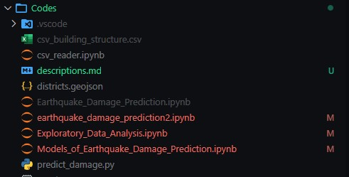

# AI BASED EARHTHQUAKE BUILDING DAMAGE PREDICTION SYSTEM
## Introduction
The project "Earthquake Damage Prediction System" is a Machine learning project developed for Fusemachines AI fellowship program. This system is developed with aim to predict damage of buildings due to earthquake. Currently, our models have been trained and tested using only Nepali earthquake dataset taken from Kaggle.com <a href="https://www.kaggle.com/code/ar89dsl/predicting-building-damage-from-earthquakes/data?select=csv_building_structure.csv"> Dataset </a>. Our system can currently predict the earthquake damage grades on buildings with test f1-score of 90% and train f1-score 95%. Here, a user will have to enter some details of the building like number of floors, height of building, age etc and then get the damage grade predicted for that building. A web app has been developed using Django to show demo of the system. 

*****

## Some information about notebooks in this repository
1. Exploratory_Data_Analysis.ipynb contains EDA of the dataset.
2. Models_of_Earthquake_Damage_Prediction.ipynb contains different models tested on the dataset to find the best model.
3. earthquake_damage_prediction2.ipynb contains different experiments performed on the dataset and various model optimization techniques.
4. predict_damage.py contains code for processing the data from webapp.
5. EarthQuake-Damage-Prediction-Demo contains Django webapp code.
6. csv_reader.ipynb simply contains code for checking output from the result csv files.
7. Results of various tests can be found inside the Results folder
8. Documentation files of this project can be found inside the Documentation folder

Note: Due to large size of dataset and trained models we couldn't include our models and dataset in this github repo but we will include the links of those files as shown in instructions below.

*****

## Some instructions to use this repository
- Clone this repository using git clone
- Install all requirements
```
    pip install -r requirements.txt
```
- Get the dataset from this link: [Dataset](https://www.kaggle.com/code/ar89dsl/predicting-building-damage-from-earthquakes/data?select=csv_building_structure.csv)  
 After downloading the dataset put it inside the Codes folder(Same folder in which the notebooks are located).  
   
 Also place the dataset inside EarthQuake-Damage-Prediction-Demo/earthquake/packages
- Download our model used in demo web app from this link: [RF Model](https://drive.google.com/file/d/1aWRfPs5901mgWIhz_ETmwSYFuWXJkvdW/view?usp=sharing)   
 Then place the model inside EarthQuake-Damage-Prediction-Demo/earthquake/packages
    
- To run the demo web app
```
    cd EarthQuake-Damage-Prediction-Demo
    python manage.py runserver
```
*****
## Demo Video
[Video Link](https://drive.google.com/file/d/1yyLWt5lkUqCut7_Fzmh3cIMME8sHmW__/view?usp=sharing)


## Contributors
[Anish Shilpakar](https://github.com/JuJu2181)  
[Anushil Timsina](https://github.com/Anushil007)  
[Sugam Karki](https://github.com/Magus4450)

******
***Feel Free to contact us if you have any confusion and It will be nice if you star this repo***
*****